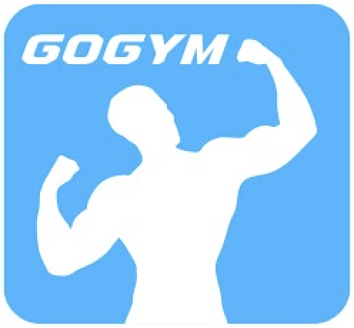

# Final-Project

  

    <h1><b>GoGym</b></h1>
    
    

        A chatbot designed to promote a healthier lifestyle by helping users schedule workout sessions, providing personalized exercise recommendations, and answering questions about physical fitness for those starting their fitness journey.
    

     

  

## 👨‍💻 **Team Members**  
- **Fauzan Azhima**  
  Data Analyst  
  [GitHub](https://github.com/fauazhima)

- **Muhammad Nuzul**  
  Data Scientist  
  [GitHub](https://github.com/mnuzulbandung)

- **Karmenia Lontoh**  
  Data Scientist  
  [GitHub](https://github.com/karenlontoh)

- **Satrio Tri Nugroho**  
  Data Engineer  
  [GitHub](https://github.com/satriotn)

## 📝 **Problem Background**  

Indonesia faces significant challenges related to public health and physical activity:  
1. **Low Physical Activity:** Many individuals lack regular exercise routines, contributing to a sedentary lifestyle.  
2. **High Gym Costs:** The cost of gym memberships is relatively expensive compared to Jakarta's minimum wage, limiting access for the broader population.  
3. **Preventable Diseases:** Three major diseases—diabetes, heart disease, and obesity—are highly preventable through consistent physical activity.  

These challenges highlight the urgent need for accessible and effective tools to encourage and guide individuals toward a healthier lifestyle.  

## 🎯 **Objective**  

To create an intelligent chatbot that:  
1. **Schedules Exercise Sessions:** Helps users plan their workout routines efficiently.  
2. **Provides Exercise Recommendations:** Suggests personalized workout plans based on user preferences and fitness levels.  
3. **Answers Fitness Questions:** Serves as a reliable source of information for beginners looking to start their fitness journey.  

## 🚀 **Features**  
1. **Interactive Chat Interface:** Engages users with a conversational approach to provide workout tips and schedules.  
2. **Smart Scheduling:** Helps users set realistic exercise goals based on their availability.  
3. **Personalized Recommendations:** Uses data to tailor workout plans to individual needs.  
4. **Fitness Knowledge Base:** Provides answers to common questions about exercise and its benefits.

   ## 🚀 **How to Use**  
1. **Ask a Question:** Type your workut-related question in the text area.
2. **Submit:** Click the "Submit" button to receive recommendations.
3. **View Responses:** The chatbot will provide detailed answers, and the conversation will be saved for your reference.

   ## 🚀 **Example Questions**  
1. **“Provide training sessions for a month!”**
2. **“Provide cardio training sessions for a month!”**
3. **“I don't have any equipment, give me a 2 week training session that suits me!”**
4. **“How to do barbell squats?”**

